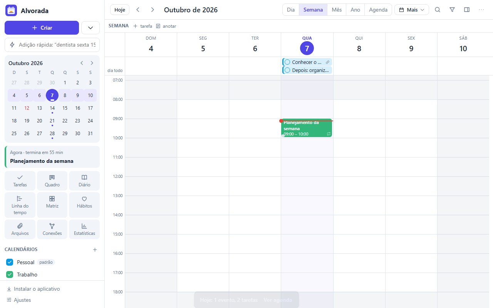

# Alvorada

[](https://joaogabrielmontinirossi-sys.github.io/alvorada.jgmrossi/)

Calendário, tarefas, lembretes e diário com arquivos, num aplicativo só. Funciona no Windows (`Alvorada.exe`), no navegador e no celular (instalável como aplicativo), sem servidor e sem conta obrigatória: os dados ficam no seu aparelho e, se você quiser, sincronizam pelo Google Drive e com o Google Agenda.

- **Site e celular:** https://joaogabrielmontinirossi-sys.github.io/alvorada.jgmrossi/
- **Windows:** baixe o `Alvorada.exe` em [Releases](https://github.com/joaogabrielmontinirossi-sys/alvorada.jgmrossi/releases/latest) e abra com dois cliques. Não precisa instalar. Se o Windows mostrar o aviso do SmartScreen, clique em *Mais informações › Executar assim mesmo*.

No celular, abra o site e use *Adicionar à tela de início* (Android: menu do Chrome; iPhone: *Compartilhar* no Safari). O Alvorada ganha ícone próprio e abre mesmo sem internet.

## Funcionalidades (154)

### Visões de calendário
1. Dia
2. Semana
3. Dias úteis
4. Vários dias (de 2 a 14, teclas 2 a 9)
5. Mês
6. Ano, com mapa de calor dos dias mais cheios
7. Agenda em lista, com "mostrar mais dias"
8. Minicalendário na barra lateral
9. Linha vermelha do "agora" na grade
10. Faixa de dia inteiro separada das horas
11. Eventos de vários dias em barra contínua
12. Eventos sobrepostos lado a lado
13. Horário de trabalho destacado na grade
14. Número da semana
15. Segundo fuso horário na grade
16. Feriados nacionais do Brasil, incluindo os móveis (Carnaval, Sexta-feira Santa, Páscoa, Corpus Christi)
17. Fases da lua
18. Esmaecer o que já passou
19. Ocultar fins de semana
20. Semana começando no domingo, na segunda ou no sábado
21. Hora em 24 h ou 12 h
22. "+N mais" nos dias cheios do mês
23. Cor do dia (do diário) pintando a célula do mês
24. Faixa de tarefas da semana, do mês e do ano no topo de cada visão
25. Ir para uma data escrevendo ("sexta", "25/12", "em 3 semanas")
26. Deslizar para os lados troca o período no celular
27. Próximo compromisso na barra lateral, com botão "Entrar" na reunião
28. Relógios de outras cidades na barra lateral

### Criar e editar
29. Arrastar na grade para criar um evento com a duração exata
30. Clicar num horário cria com a duração padrão
31. Arrastar um evento para mudar dia e hora
32. Puxar a borda de baixo para mudar a duração
33. Arrastar itens entre dias no mês, na agenda e nas faixas de período
34. Arrastar uma tarefa do painel para a grade para reservar um horário
35. Cartão de criação rápida no próprio calendário
36. Adição rápida em linguagem natural: datas, horas, intervalos ("9h-10h30"), duração ("por 2h"), repetição ("toda segunda", "dias úteis"), `#etiqueta`, `!alta`, `@local`, `~lista` e os prefixos `tarefa:`, `lembrete:` e `evento:`
37. Editor completo em janela
38. Cartão de detalhes ao clicar
39. Duplo clique abre o editor
40. Menu do botão direito em qualquer item
41. Duplicar
42. Repetir uma cópia amanhã ou daqui a 7 dias
43. Converter entre evento, tarefa e lembrete
44. Modelos de item reutilizáveis
45. Aviso de alterações não salvas, com "Voltar a editar"

### Tipos e campos
46. Eventos
47. Tarefas
48. Lembretes
49. Itens com horário, no dia, na semana, no mês, no ano ou sem data
50. Prazo separado da data de execução
51. Local, com atalho para o mapa
52. Link de reunião, e criação de sala gratuita no Jitsi Meet
53. Convidados com resposta (sim, não, talvez)
54. Convite por e-mail com arquivo `.ics` pronto
55. Descrição com formatação
56. Subitens (checklist) com progresso automático
57. Cor por item: 16 cores ou qualquer outra
58. Calendário de cada item
59. Lista ou projeto de cada item
60. Etiquetas
61. Prioridade em 5 níveis
62. Situação: a fazer, em andamento, aguardando, concluída, cancelada
63. Progresso em porcentagem
64. Estimativa de tempo
65. Tipos de evento: tempo de foco, fora do escritório, local de trabalho, aniversário, viagem
66. Visibilidade pública ou particular
67. Ocupado ou disponível
68. Fuso horário próprio do evento
69. Fixar no topo
70. Vários avisos por item (na hora, minutos, horas, dias ou semanas antes)
71. Anexos dentro do item

### Repetição
72. Opções prontas: diária, dias úteis, semanal, quinzenal, mensal (por dia ou "2ª terça"), última semana do mês, anual
73. Repetição personalizada: intervalo, dias da semana, enésimo dia do mês, último dia do mês, termina numa data ou após N vezes
74. Alterar só esta ocorrência, esta e as seguintes, ou todas
75. Excluir com a mesma escolha
76. Concluir cada ocorrência de uma tarefa repetida separadamente
77. Descrição da regra em português ("Toda semana: seg, qua")

### Tarefas
78. Abas Entrada, Hoje, 7 dias, Atrasadas, Semana/mês/ano, Todas e Concluídas, com contagem
79. Agrupar por data, lista, prioridade, situação, etiqueta ou calendário
80. Ordenar de 6 formas, incluindo a ordem inteligente (fixadas, prioridade, data)
81. Subtarefas aninhadas
82. Seleção múltipla com ações em lote: concluir, data, lista, etiqueta, prioridade, excluir
83. Adiar para hoje, amanhã, próxima segunda, 1 semana, 1 mês ou sem data
84. Contador de tarefas atrasadas na barra lateral
85. Concluir a tarefa-mãe quando todas as subtarefas terminam (opcional)
86. Quadro kanban com colunas por situação, prioridade, lista ou calendário
87. Arrastar cartões entre colunas
88. Matriz de Eisenhower, com arrastar entre quadrantes
89. Linha do tempo (Gantt) com zoom de 2 a 12 semanas e setas de dependência
90. Painel de tarefas ao lado do calendário

### Vínculos entre itens
91. Seis tipos: bloqueia, vem antes de, relacionada, subtarefa, duplicada e menção
92. Aviso de tarefa bloqueada
93. Aviso "Liberada" ao concluir o que bloqueava outra tarefa
94. Ao mover um item, oferece mover junto os que dependem dele
95. Mapa de conexões em grafo, com filtro por tipo
96. Mencionar tarefas e eventos no diário com `@`

### Diário
97. Anotações por dia
98. Por semana
99. Por mês
100. Por ano
101. Páginas livres com título
102. Editor com títulos, listas, checklist, citação, código, link, marca-texto, cor, linha, imagem, hora e tabela
103. Colar imagens direto no texto
104. Humor do dia
105. Cor do dia
106. Contagem de palavras e salvamento automático
107. Modelo de anotação diária
108. Inserir a agenda do dia no texto
109. "Neste dia, em outros anos"
110. Agenda do dia ao lado do texto, com adição rápida
111. Hábitos do dia ao lado do texto
112. Exportar como `.html` ou `.txt`
113. Gravar áudio pelo microfone

### Arquivos
114. Anexar arquivos de qualquer tipo (até 300 MB cada) ao diário ou a qualquer item
115. Arrastar arquivos para a janela
116. Pré-visualização de imagens, vídeos, áudios, PDFs e textos
117. Miniaturas das imagens
118. Visão Arquivos, com busca e filtro por tipo

### Hábitos e estatísticas
119. Hábitos com sequência de dias e meta semanal
120. Estatísticas da semana, do mês ou do ano: tempo por calendário e por etiqueta, dias e horários mais ocupados, tempo em reuniões e em foco, tarefas concluídas e porcentagem do planejado

### Organização
121. Vários calendários: mostrar, ocultar, "mostrar só este", calendário padrão
122. Listas e projetos com emoji, cor e arquivamento
123. Etiquetas coloridas, com renomear e excluir
124. Filtros por tipo, prioridade, situação e texto
125. Visões salvas na barra lateral
126. Paleta de comandos (Ctrl+K) que pesquisa itens, anotações e arquivos
127. Lixeira por 30 dias
128. Desfazer e refazer qualquer alteração (Ctrl+Z, Ctrl+Y)

### Avisos
129. Notificações do sistema
130. Som nos avisos e ao concluir tarefas
131. Adiar um aviso por 10 minutos
132. Resumo do dia ao abrir
133. Número de tarefas do dia no ícone do aplicativo instalado

### Disponibilidade
134. Encontrar horários livres no seu horário de trabalho e copiar o texto para enviar a alguém

### Dados e sincronização
135. Tudo guardado no aparelho (IndexedDB), funciona sem internet
136. Aplicativo instalável (PWA) que abre offline
137. Backup em `.json`, com ou sem os arquivos
138. Importar backup, mesclando com o que já existe
139. Importar `.ics` (Google Agenda, Outlook, Apple)
140. Exportar `.ics` de tudo, de um calendário ou de um item
141. Assinar um calendário por endereço (atualiza a cada 6 horas)
142. Sincronização por uma pasta do Google Drive para computador (no `.exe`)
143. Sincronização entre Windows, site e celular pela conta Google (área privada do app no Drive)
144. Google Agenda nos dois sentidos

### Aparência e uso
145. Tema claro, escuro ou automático
146. Cor de destaque
147. Densidade compacta, normal ou confortável
148. Quatro letras: padrão, serifada, arredondada e monoespaçada
149. Ocultar a barra lateral
150. Tela cheia
151. Imprimir a visão atual
152. Atalhos de teclado para tudo (tecla `?` mostra a lista)
153. Layout de celular com barra inferior e botão de criar

### Windows
154. `Alvorada.exe` de 400 KB, sem instalação: abre numa janela própria e guarda os dados em `%LOCALAPPDATA%\Alvorada`

## Sincronização

**Pasta do Google Drive (só no `.exe`).** Em *Ajustes › Sincronização*, clique em *Ativar no Google Drive*. O Alvorada grava `alvorada-sync.json` e a subpasta `arquivos` na pasta do Drive para computador, e o Drive leva tudo para os outros computadores, como nos outros aplicativos.

**Conta Google (Windows, site e celular, e Google Agenda).** O Google exige que cada aplicativo tenha um "ID do cliente OAuth". Ele é gratuito, você cria uma vez só na sua conta, e o passo a passo completo está em *Ajustes › Sincronização › Ver o passo a passo*. Em resumo:

1. Em [console.cloud.google.com](https://console.cloud.google.com/projectcreate), crie um projeto.
2. Ative a **Google Calendar API** e a **Google Drive API**.
3. Configure a tela de permissão OAuth como **Externo** e adicione o seu e-mail em *Usuários de teste*.
4. Crie um **ID do cliente OAuth** do tipo *Aplicativo da Web*, com estas origens autorizadas: `https://joaogabrielmontinirossi-sys.github.io` e `http://localhost:47841`.
5. Cole o ID no Alvorada e clique em *Conectar ao Google*.

> A sincronização pela conta Google e com o Google Agenda foi escrita, mas ainda não rodou contra o Google de verdade. Teste com poucos dados primeiro e mantenha um backup.

## Como o projeto está organizado

```
app/            o aplicativo (HTML, CSS e JavaScript puros, sem dependências)
  store.js      utilitários, banco local (IndexedDB) e desfazer
  dates.js      datas, repetição, linguagem natural, feriados e .ics
  ui.js         janelas, menus e operações sobre itens
  cal.js        visões de calendário e arrastar na grade
  tasks.js      tarefas, quadro, matriz, linha do tempo, conexões, hábitos e estatísticas
  editor.js     criação rápida, cartão de detalhes e editor
  notes.js      editor de texto, diário e arquivos
  sync.js       sincronização (pasta, Google Drive e Google Agenda)
  settings.js   ajustes, paleta de comandos, disponibilidade e backup
  app.js        navegação, atalhos, avisos e inicialização
desktop/        Alvorada.cs: servidor local e janela do programa de Windows
build.ps1       gera os ícones e compila dist\Alvorada.exe
```

Para testar a versão web no computador, sirva a pasta `app` com qualquer servidor estático (por exemplo `python -m http.server` dentro dela) e abra o endereço no navegador.

Para compilar o `.exe` no Windows, rode `powershell -ExecutionPolicy Bypass -File build.ps1`. Ele usa só o que já vem no Windows (o compilador C# do .NET Framework). Com `-Icons`, refaz os ícones a partir do `app/logo.svg` usando o Edge.

A cada envio para a `main`, o GitHub Actions publica o site no GitHub Pages (`.github/workflows/web.yml`) e compila o `.exe` numa máquina Windows, publicando-o em Releases (`.github/workflows/windows.yml`).

## Licença

[MIT](LICENSE): pode usar, copiar, modificar e distribuir livremente, mantendo o aviso de autoria.
